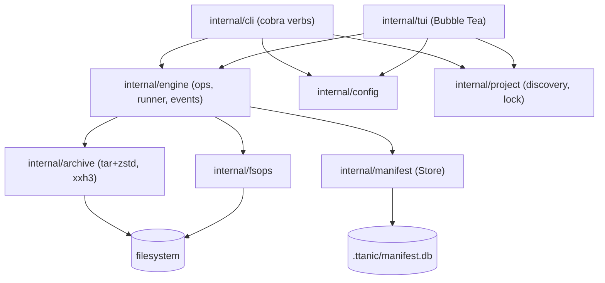
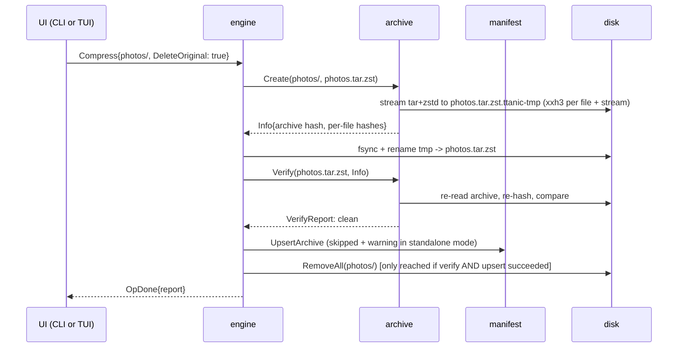
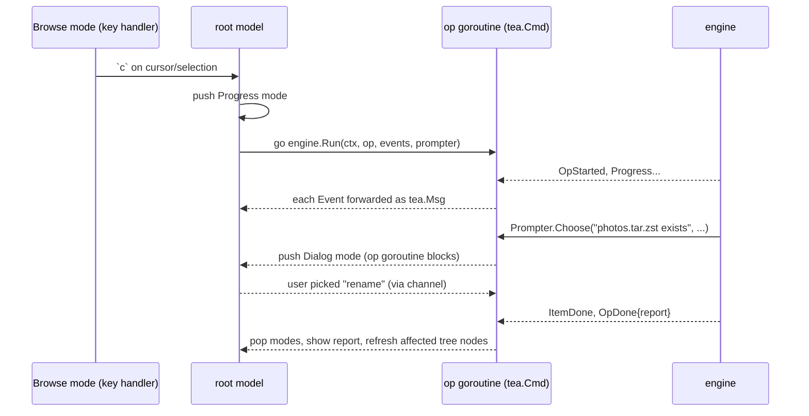

# ttanic LLD

Low-level design for `ttanic`. The HLD (`ttanic-hld.md`) holds the *what* and *why*; this document holds the *how*. When the two disagree, fix the disagreement -- don't code around it.

## Guiding principles

1. **The engine is a library.** Everything the tool does lives in `internal/` packages with no knowledge of terminals. The CLI and TUI are thin adapters that translate user input into engine operations and engine events into pixels. Every feature must be testable without a UI.
2. **Operations are messages.** A user intent ("compress these three dirs and delete originals") is a value. The engine executes it and emits event values. This is what lets the MVP's modal execution become a job queue later without touching the engine.
3. **Never lose data.** Archives are written atomically, originals are deleted only after verification, destructive actions go through a `Prompter`. There is no code path that silently overwrites or deletes.
4. **Fail loud, continue where sensible.** Batch operations continue past per-item errors and report; anything touching the manifest in standalone mode warns or errors as specified in the HLD.

## Module and repository layout

Module path: `github.com/Hoxmot/ttanic`. Toolchain: Go 1.26. CGo disabled (`CGO_ENABLED=0`).

```
ttanic/
├── cmd/ttanic/main.go        # wiring only: config load, cobra root, exit codes
├── internal/
│   ├── config/               # defaults, discovery, TOML loading, merging
│   ├── project/              # .ttanic/ discovery, init, locking
│   ├── archive/              # tar+zstd create/list/extract/verify, hashing
│   ├── manifest/             # Store interface, model types
│   │   └── sqlite/           # SQLite backend (modernc.org/sqlite)
│   ├── engine/               # operations, runner, events, prompter
│   ├── fsops/                # copy/move/rename/delete primitives
│   ├── cli/                  # cobra commands
│   └── tui/                  # Bubble Tea app
│       ├── theme/            # Theme struct, default theme
│       ├── keymap/           # key -> action table
│       └── views/            # tree, statusbar, dialogs, wizard, help
├── docs/
├── justfile                  # task runner (casey/just)
├── .golangci.yaml
└── .goreleaser.yaml
```

Direct dependencies (all pure Go):

| Dependency | Purpose |
|---|---|
| `github.com/klauspost/compress/zstd` | zstd streams |
| `modernc.org/sqlite` | manifest backend, CGo-free |
| `github.com/zeebo/xxh3` | XXH3-128 hashing |
| `github.com/BurntSushi/toml` | config (has `MetaData.IsDefined` for merge semantics) |
| `github.com/spf13/cobra` | CLI verbs, completions |
| `github.com/charmbracelet/bubbletea`, `bubbles`, `lipgloss`, `huh` | TUI |
| `github.com/sahilm/fuzzy` | fuzzy matching for `<leader>/` |

## Tooling

- **Task runner: `just`** (casey/just) rather than make -- recipes are plain commands without phony-target ceremony. Baseline `justfile` recipes: `build`, `test`, `cover`, `lint`, `fmt`, `run`, `snapshot` (`goreleaser release --snapshot --clean`), and `ci` (fmt-check + lint + test -- the exact set GitHub Actions runs, so CI is reproducible locally).
- **Linting**: `golangci-lint` (govet, staticcheck, errcheck, revive), configured in `.golangci.yaml`.
- `just` is a dev-time dependency only; users installing via `go install` or release binaries never need it.

## Domain types (`internal/engine`, shared)

```go
type NodeKind uint8

const (
    KindFile NodeKind = iota
    KindDir
    KindSymlink
    KindArchive      // a .tar.zst on disk
    KindArchiveEntry // a file inside an archive (from manifest or listing)
)

// Entry is one row in the tree: a real filesystem object or a virtual
// archive-content object.
type Entry struct {
    Path    string // project-root-relative, '/'-separated; for archive entries: "<archive path>!<inner path>"
    Kind    NodeKind
    Size    int64
    ModTime time.Time
    Status  Status // manifest status, KindArchive only
}

type Status uint8 // StatusNone | StatusOK | StatusStale | StatusMissing | StatusUntracked
```

## `internal/archive`

Stateless functions over streams. Never shells out; never touches the manifest.

### Naming

- Directory `photos/` -> `photos.tar.zst`
- File `notes.txt` -> `notes.txt.tar.zst` (extension kept visible, no collision between `notes.txt` and `notes.md`)
- Anything ending in `.tar.zst` is treated as an archive; everything else is a plain file.

### API

```go
type FileRecord struct {
    Path    string      // '/'-separated, relative to archive root
    Size    int64
    Mode    fs.FileMode
    ModTime time.Time
    XXH3    string      // hex XXH3-128 of content; empty for dirs/symlinks
    LinkTarget string   // symlinks only
}

type Info struct {
    XXH3      string       // hash of the compressed archive stream
    Size      int64        // archive size on disk
    OrigSize  int64        // sum of member sizes
    Files     []FileRecord
}

func Create(ctx context.Context, src, dst string, opt CreateOptions) (*Info, error)
func List(ctx context.Context, path string) (*Info, error)              // streams, no extraction
func Extract(ctx context.Context, src, dstDir string, opt ExtractOptions) error
func Verify(ctx context.Context, path string, want *Info) (*VerifyReport, error)
func SHA256(ctx context.Context, path string) (string, error)           // for the sums feature
```

### Create pipeline

```
walk(src) ──> tar.Writer ──> zstd.Writer ──> xxh3-tee ──> dst.ttanic-tmp ──rename──> dst
   │
   └─ per file: io.Copy(tar, io.TeeReader(f, xxh3.New()))   // content hashed while streamed, file read once
```

- Walk order is lexicographic (deterministic archives for identical input).
- Per-file XXH3-128 collected into `Info.Files`; the whole compressed stream is hashed into `Info.XXH3` by a tee on the output writer.
- zstd encoder: level from config (`fastest|default|better|best` map to the klauspost `SpeedX` constants), `WithEncoderConcurrency(workers)`.
- **Atomicity**: write to `<dst>.ttanic-tmp` in the destination directory, `fsync`, then `rename`. Any error removes the temp file. A crash leaves at most a `*.ttanic-tmp` file, which scan reports for cleanup and the tree view hides.
- Ignore patterns (gitignore-style, from config) are applied by the walker.

### Extract safety

- Reject entries whose cleaned path escapes `dstDir` (`..`, absolute paths) -- fail the whole extraction, this is a malformed archive.
- Never write *through* a symlink: if an ancestor of the target resolves to a symlink created during this extraction, error.
- Restore mode and mtime; restore symlinks as symlinks (targets verbatim, not validated -- they may point anywhere, same as tar).
- Collision: if the extraction target (the top-level directory or file the archive would create) already exists, error immediately, before a single byte is written. No merging into existing directories, no overwrite prompt -- the user renames or removes the obstacle and retries. (Compression collisions keep the overwrite/rename/abort prompt; the asymmetry is deliberate: overwriting an archive replaces one file, merging into a directory entangles two trees.)

### Symlinks and hardlinks

MVP does not archive symlinks. When the create-walker meets one, behavior follows config `archive.on_symlink`:

- `error` (default): fail that item with a message naming the symlink -- nothing is silently left out
- `skip`: omit it from the archive; the operation report counts it as skipped

Future: a `follow` mode that resolves targets and stores their content (needs loop detection and a policy for targets outside the tree), and/or storing links as tar `TypeSymlink` entries. The manifest `files.kind`/`link_target` columns already accommodate that.

Extraction is more permissive than creation: foreign archives may legitimately contain symlink entries, and those are restored as symlinks (targets verbatim, never dereferenced). Hardlink entries are extracted as regular files.

### Verify

`Verify` re-streams the archive: checks the stream hash against `want.XXH3`, then walks the tar comparing every member's size and content XXH3 against `want.Files`. Returns a report of mismatches; empty report == verified.

## `internal/manifest`

### Store interface

```go
type Store interface {
    // archives
    UpsertArchive(ctx context.Context, a Archive, files []archive.FileRecord) error
    GetArchive(ctx context.Context, relPath string) (*Archive, error)
    ListArchives(ctx context.Context) ([]Archive, error)
    RenamePrefix(ctx context.Context, oldPrefix, newPrefix string) error // rename/move support
    DeleteArchive(ctx context.Context, relPath string) error
    SetSHA256(ctx context.Context, relPath, sum string) error
    // SetStatus persists a scan verdict (ok|stale|missing) on an archive row,
    // so the TUI can show last-known status markers without rescanning.
    SetStatus(ctx context.Context, relPath string, s Status) error
    // contents
    ListFiles(ctx context.Context, relPath string) ([]archive.FileRecord, error)
    AllFilePaths(ctx context.Context) ([]PathRef, error) // feed for fuzzy search
    // Close flushes and releases the backend (for SQLite: checkpoints the WAL,
    // closes the db handle). Store is an io.Closer; callers defer it.
    Close() error
}
```

MVP ships the SQLite implementation; the interface is the seam for the future JSONL backend. A conformance test suite (`manifest/storetest`) runs against any implementation.

### SQLite backend

One file: `.ttanic/manifest.db`, WAL mode, `foreign_keys=ON`.

```sql
CREATE TABLE meta (
  key   TEXT PRIMARY KEY,   -- 'schema_version', 'ttanic_version', 'created_at'
  value TEXT NOT NULL
);

CREATE TABLE archives (
  id         INTEGER PRIMARY KEY,
  rel_path   TEXT NOT NULL UNIQUE,  -- project-root-relative, '/'-separated
  size       INTEGER NOT NULL,      -- bytes on disk when recorded
  mtime_ns   INTEGER NOT NULL,      -- archive file mtime when recorded
  xxh3       TEXT NOT NULL,         -- compressed-stream hash, hex
  sha256     TEXT,                  -- NULL until `sums` computes it
  file_count INTEGER NOT NULL,
  orig_size  INTEGER NOT NULL,      -- uncompressed total
  created_ns INTEGER NOT NULL,
  status     TEXT NOT NULL DEFAULT 'ok'  -- ok|stale|missing
);

CREATE TABLE files (
  archive_id  INTEGER NOT NULL REFERENCES archives(id) ON DELETE CASCADE,
  rel_path    TEXT NOT NULL,        -- path inside the archive
  size        INTEGER NOT NULL,
  mode        INTEGER NOT NULL,
  mtime_ns    INTEGER NOT NULL,
  xxh3        TEXT NOT NULL,        -- '' for dirs/symlinks
  kind        INTEGER NOT NULL,     -- 0 file, 1 dir, 2 symlink
  link_target TEXT,
  PRIMARY KEY (archive_id, rel_path)
) WITHOUT ROWID;

CREATE INDEX idx_files_relpath ON files(rel_path);
```

`size` + `mtime_ns` on `archives` are what the quick scan compares against `stat()`; `xxh3` is what the deep scan compares.

Contents are stored flat (`rel_path` per row), not as a parent-pointer graph: archive contents are immutable, so the tree never mutates in place -- the one operation graphs are good at. The TUI's expanded-archive tree is built in memory: one `WHERE archive_id = ?` fetch, then an O(n) pass splitting paths on `/`. That in-memory node structure is needed for rendering under either storage design; flat paths just make the fetch, prefix queries, and the fuzzy-search feed trivial.

### Migrations (resolved open question)

`meta.schema_version` holds an integer. Migrations are an ordered, embedded list of SQL scripts applied in one transaction at open when the stored version is behind. Before migrating, the backend copies `manifest.db` to `manifest.db.bak` (cheap insurance; overwritten each migration). Opening a manifest with a version *newer* than the binary understands is an error ("upgrade ttanic"), never a silent downgrade.

### Search

Fuzzy search does not use SQL matching. The engine assembles candidates -- loose file paths from a filesystem walk plus `AllFilePaths()` from the manifest (each tagged with its containing archive) -- and ranks them in memory with `sahilm/fuzzy`.

Loose files are deliberately **not** indexed in the manifest: the filesystem already is the authoritative, always-fresh index of loose files (one walk is cheap), and mirroring it would turn every ordinary `mv`/`rm` done in a shell into manifest drift. The manifest indexes only what cannot be `stat`ed directly -- archive contents. Simple, and fine into the hundreds of thousands of entries; if a profile ever says otherwise, an FTS5 prefilter can be added behind the same engine call.

### Drift: scan

Two levels, both producing a `ScanReport` -- scan never mutates the manifest itself; fixes are separate, explicit operations (the TUI offers them from the report view).

- **Quick scan** (TUI startup; `ttanic scan`): walk the project for `*.tar.zst`, `stat()` each, compare with `archives` rows. Produces: `missing` (in manifest, not on disk), `stale` (size or mtime differs), `untracked` (on disk, not in manifest), plus leftover `*.ttanic-tmp` files. Costs one directory walk; no file reads.
- **Deep scan** (`ttanic scan --deep`; `:scan!`): quick scan + re-hash each archive stream and compare `xxh3` (detects bit-rot and same-size tampering). Optionally `--contents` to verify member hashes too.

Fix operations: `forget` (drop manifest row), `adopt` (List + hash an untracked archive into the manifest), `rehash` (accept the disk state as the new truth for a stale entry).

## `internal/project`

- **Discovery**: walk up from CWD looking for `.ttanic/`. Nearest ancestor wins. Inside a project, walks (scan, recursive compress, tree) that encounter *another* `.ttanic/` deeper down treat that subtree as a foreign project: skip it and warn (resolved open question).
- **Init**: creates `.ttanic/config.toml` (commented defaults) and the manifest. The TUI wizard (`huh`) asks: compression level, ignore patterns, confirm defaults; `ttanic init` takes the same as flags with sane defaults.
- **Locking**: `.ttanic/lock` acquired with `flock` (LOCK_EX|LOCK_NB) for the process lifetime; contains PID for diagnostics. Two concurrent ttanic instances on one project would race verify-then-delete; the second instance fails fast with a clear message. Read-only commands (`ls`, `search`) skip the lock.
- **Crash safety**: this is why it's `flock` and not a lock*file whose existence is the lock*. The lock lives on the open file descriptor, so the kernel releases it the instant the process dies -- crash, SIGKILL, panic, anything. A leftover `.ttanic/lock` file after a crash is inert; the next instance simply flocks it again. No stale-lock detection or cleanup logic exists because none is needed.

## `internal/config`

```toml
[compression]
level   = "default"   # fastest | default | better | best
workers = 0           # 0 = GOMAXPROCS

[archive]
on_symlink = "error"  # error | skip   ("follow" is future work)

[ui]
theme       = "default"
show_hidden = false
sort        = "name"  # name | size | mtime
editor      = ""      # "" -> $VISUAL -> $EDITOR
leader      = "space" # prefix key for chords, e.g. <leader>/ = fuzzy search
icons       = "unicode" # unicode | nerd | ascii
```

**Global config dir**: `$XDG_CONFIG_HOME/ttanic/` when the variable is set, otherwise `~/.config/ttanic/` -- on macOS too. (Deliberately *not* `os.UserConfigDir`, which on macOS points at `~/Library/Application Support`; CLI users expect and dotfile-manage `~/.config`.)

Load order: built-in defaults -> global `config.toml` -> `<project>/.ttanic/config.toml`. Merging is per-key: a key overrides only if the file actually defines it (checked with `toml.MetaData.IsDefined`), so a project file setting only `level` doesn't reset UI preferences.

**Ignore patterns** live in dedicated files, not in config: `~/.config/ttanic/ignore` (global) and `.ttanic/ignore` (project), gitignore syntax including `!` negation. Unlike config keys, ignore files *layer*: global patterns apply first, project patterns append and can negate them -- same model as `~/.config/git/ignore` vs `.gitignore`. Edited by hand or via `ttanic ignore`.

Deliberately not configurable: delete confirmation and verify-then-delete. Those are safety invariants, not preferences.

## `internal/engine`

### Operations

```go
type Op interface{ Describe() string }

type Compress struct{ Targets []string; DeleteOriginal, Recursive bool }
type Decompress struct{ Targets []string; Recursive bool }
type Delete struct{ Targets []string }          // the HLD's compress-state-aware delete flow
type Copy struct{ Sources []string; Dst string }
type Move struct{ Sources []string; Dst string } // cut+paste, rename
type Scan struct{ Deep, Contents bool }
type Verify struct{ Targets []string }
type Sums struct{ Targets []string; Write bool } // sha256; Write caches into manifest + emits SHA256SUMS
type Init struct{ Answers InitAnswers }
```

### Runner and events

```go
type Event any // OpStarted | ItemStarted | Progress | ItemDone | OpDone

type Progress struct{ Item string; BytesDone, BytesTotal int64 }
type ItemDone struct{ Item string; Err error }        // batch continues past errors
type OpDone struct{ Report Report }                    // succeeded / failed / skipped with reasons

func (e *Engine) Run(ctx context.Context, op Op, events chan<- Event, p Prompter) error
```

- One `Run` at a time in MVP (the modal); the signature already supports a queue later.
- Cancellation via `ctx`; a cancelled compress removes its temp file, a cancelled batch reports completed items.
- **Partial failure** (resolved): batch items are independent and atomic; on item error the batch continues and the report says what failed and why. Exception: `ENOSPC` aborts the whole run -- retrying without space is pointless.

### Prompter

```go
type Prompter interface {
    Confirm(ctx context.Context, q string) (bool, error)                 // deletes; default no
    Choose(ctx context.Context, q string, opts []string) (int, error)    // collision: overwrite/rename/abort
}
```

CLI implements it with stdin prompts (`--yes` answers Confirm true for scripting, never auto-resolves collisions). TUI implements it as a modal dialog; the op goroutine blocks on a channel until the user decides. The delete dialog additionally accepts `d` as "yes" so `dd` works.

### Invariant flows

**Verify-then-delete** (compress with `DeleteOriginal`, and the delete flow's "compress and delete" branch):

1. `archive.Create` -> temp file, hashes collected
2. rename into place
3. `archive.Verify` against the in-memory `Info` (re-read from disk -- catches torn writes and lying disks)
4. `manifest.UpsertArchive` (skipped with a warning in standalone mode)
5. only now: delete the original (recursive `os.RemoveAll`)

Steps 3-4 failing leaves both the archive and the original in place.

**Delete** (`d`): if the target is an archive, or a directory/file whose sibling archive exists in the manifest -> confirm -> delete. Otherwise -> `Choose(delete / compress-then-delete / abort)` per the HLD.

**Manifest-synced file ops**: `Move`/`Copy`/`Delete` on a tracked archive call `RenamePrefix`/`UpsertArchive`/`DeleteArchive` in the same operation. On loose files they're plain `fsops`.

### sha256 sums (resolved open question)

`Sums` computes SHA-256 of the requested archives (all tracked archives if no target), emits `SHA256SUMS`-format lines (`<hex>  <path>`) compatible with `sha256sum -c` / `shasum -a 256 -c`, and with `Write: true` also caches each sum in `archives.sha256` and writes the `SHA256SUMS` file. xxh3 remains the integrity mechanism; sha256 exists purely for comparison with the outside world.

## Flows

Component view -- who is allowed to call whom:



Verify-then-delete, the central safety flow:



A TUI operation end to end, including a mid-flight prompt:



## `internal/cli` (cobra)

```
ttanic                      -> launches TUI
ttanic init                 [--interactive]
ttanic compress <path>...   [--delete] [--recursive]
ttanic decompress <path>... [--recursive]
ttanic ls <archive>         # manifest if tracked, archive.List otherwise
ttanic rm <path>...         [--yes]
ttanic cp <src>... <dst>    # manifest-synced copy (archives); plain files work too
ttanic mv <src>... <dst>    # manifest-synced move/rename
ttanic search <query>
ttanic scan                 [--deep] [--contents]
ttanic verify <archive>...
ttanic sums [<archive>...]  [--write]
ttanic ignore <pattern>...  [--global]   # append to the ignore file
ttanic ignore list                       # print effective patterns and their source
ttanic config               [get <key> | set <key> <value> | edit]
ttanic version
```

(`cp`/`mv` earn their place for exactly one reason: keeping the manifest in sync from scripts. They are thin wrappers over the same `Copy`/`Move` ops the TUI uses.)

`ttanic init` defaults to non-interactive (flags + sane defaults, scriptable). `--interactive` asks the same questions as the TUI wizard through plain terminal prompts -- `huh` forms run standalone without a Bubble Tea program, so this is the same form code, not a parallel implementation.

Conventions: errors to stderr, exit 0 success / 1 operational failure (details in the report) / 2 usage error. Progress events render as a single rewriting line when stderr is a TTY, silence otherwise. `--json` output is post-MVP but the command layer only ever formats `Report` values, so adding it is a formatter, not a refactor.

## `internal/tui` (Bubble Tea)

### Model structure

One root `tea.Model` owning:

```go
type App struct {
    mode    []Mode        // stack: Browse is the bottom; push Command/Search/Dialog/Progress/Wizard/Help on top
    tree    *views.Tree   // the file tree
    status  views.StatusBar
    clip    Clipboard     // {paths []string, cut bool}
    sel     Selection     // explicit set + visual-mode anchor
    engine  *engine.Engine
    theme   theme.Theme
    keys    keymap.Map
}
```

The mode stack routes key events: the top mode gets them first (a dialog swallows everything; Browse handles navigation). `?` pushes Help, `:` pushes Command, `/` pushes Search (filter within tree), `<leader>/` pushes FuzzySearch, `ESC` pops / clears selection.

### Tree view

- Nodes load lazily per directory (one `ReadDir` per expansion), sorted per config, ignore patterns and `*.ttanic-tmp` hidden, hidden files per config.
- Archive nodes carry their manifest `Status`, rendered as a marker + theme color (`✓` ok, `~` stale, `✗` missing, `?` untracked).
- Expanding an archive shows its contents read-only: from the manifest if tracked (instant), else via `archive.List` (streams the file; show a spinner and cache the result for the session).
- Redraw only the viewport (bubbles `viewport`); tree state is a flat visible-rows slice recomputed on expand/collapse, so rendering is O(screen), not O(tree).

### Keymap (Browse mode)

| Key | Action |
|---|---|
| `hjkl` / arrows | navigate (h collapses/up, l expands/enters) |
| `c` / `C` | compress / compress children recursively |
| `i` / `I` | decompress / decompress recursively |
| `d` | delete (confirm dialog; `d` confirms -> `dd`) |
| `y` / `x` / `p` | copy / cut / paste (applies to selection if any) |
| `r` | rename (inline input) |
| `e` | open file in editor (`tea.ExecProcess`, TUI suspends) |
| `v` / `V` | toggle select / visual range mode |
| `S` | init wizard (uninitialised only) |
| `:` | command line (`:cd`, `:scan`, `:scan!`, `:init`, `:config`, `:sums`, `:q`) |
| `/`, `<leader>/` | filter, fuzzy search |
| `?` | help |
| `ESC` | pop mode / clear selection |

`<leader>` is a configurable prefix key (`ui.leader`, default: space) pressed *before* the next key, vim-style -- so fuzzy search is `space` then `/`.

Keymap is a data table in `keymap/`, both to feed the help view and because remappable keys (v2) then become a config loader, not a rewrite.

### Operations in the TUI

Key press -> build `Op` from selection/cursor -> push Progress mode -> `tea.Cmd` goroutine runs `engine.Run`, forwarding each `Event` as a `tea.Msg`. The Progress view renders per-item progress and supports cancel (`ESC` -> `ctx` cancel -> confirm). `Prompter` dialogs pause the run mid-flight. On `OpDone`, show the report (briefly for clean runs; sticky if anything failed) and refresh affected tree nodes.

Startup runs the quick scan as a background `tea.Cmd`; results merge into tree node statuses without blocking first paint.

### Theme

```go
type Theme struct {
    Base, Selected, Directory, File, Archive lipgloss.Style
    StatusOK, StatusStale, StatusMissing, StatusUntracked lipgloss.Style
    DialogBorder, Help, ProgressBar lipgloss.Style
}
```

All views take `*Theme`; nothing constructs a `lipgloss.Style` inline. MVP: built-in default only; the post-MVP file loader just fills this struct from `~/.config/ttanic/themes/<name>.toml`.

### Icons

An `IconSet` (glyphs for dir/file/archive, expand markers, status markers) sits beside `Theme`; views take both. Three built-ins, selected by `ui.icons`:

- `unicode` (default): safe, widely-rendered glyphs -- `▸`/`▾` expand, `✓ ~ ✗ ?` statuses
- `nerd`: NerdFont file-type and status glyphs. Opt-in only -- there is no reliable way to detect a patched font, and without one everything renders as tofu
- `ascii`: pure ASCII for minimal terminals

Like themes, icon sets are one struct fill -- future custom sets can load from the theme file.

## Testing strategy

**Where tests live**: next to the code they test, Go-style -- `create.go` gets `create_test.go` in the same directory. Same-package tests (`package archive`) for white-box internals, `package archive_test` for exercising the public API. Fixtures (crafted tars, v1 manifest dbs) go in `testdata/` directories beside their tests; the `go` tool ignores those by convention. The CLI's end-to-end scripts are `internal/cli/testdata/*.txtar`. There is no separate top-level test tree -- the only shared test code is `manifest/storetest`, the backend conformance suite, which is an ordinary package.

**Shape**: a pyramid. The bulk of coverage sits in `archive` and `engine` unit/integration tests against real temp directories (they're fast -- no mocking the filesystem). CLI testscripts cover wiring and output contracts. TUI tests are the thinnest layer because the TUI deliberately contains no logic worth testing beyond rendering and key routing. Run via `just test` / `just cover`; `just ci` is the gate.

Per package:

- `archive`: round-trip goldens (create -> list -> extract -> byte-compare), symlink cases, traversal-attack fixtures (crafted tars with `../` and absolute paths must be rejected), cancellation leaves no temp files.
- `manifest/storetest`: interface conformance suite, run by the sqlite backend now and the jsonl backend later; migration test opens a v1 fixture db.
- `engine`: tempdir-based tests per op, failure injection (unreadable child mid-batch, ENOSPC via a wrapping FS, kill between create and verify), verify-then-delete invariant tests ("original never gone unless archive verified").
- `cli`: `testscript` (rogpeppe/go-internal) end-to-end scripts -- init, compress, tamper with a byte, scan --deep catches it.
- `tui`: `teatest` golden-frame tests for the key flows; kept thin because logic lives in the engine.
- CI: GitHub Actions, macOS + Linux matrix. Windows: not built, not tested, not promised (resolved: unsupported).

## Milestones

Engine-and-CLI first (decided): each milestone is shippable.

- **M1 -- core engine + CLI.** `config`, `project`, `archive`, `manifest/sqlite`, `engine` with Compress/Decompress/Delete/Scan/Verify; CLI verbs `init`, `compress` (incl. `--delete`, `--recursive`), `decompress`, `ls`, `rm`, `scan`, `verify`. Verify-then-delete invariant tested. Usable tool at the end.
- **M2 -- TUI browse + core ops.** Tree navigation, quick-scan-on-open statuses, `c C i I d`, progress modal, confirm/collision dialogs, `?` help, `:` commands, init wizard.
- **M3 -- manifest UX + file ops.** Archive expansion, `/` filter, `<leader>/` fuzzy search, multi-select (`v`/`V`), `y x p r e`, `cp`/`mv`/`search`/`sums` CLI verbs, config view.
- **M4 -- release.** goreleaser (darwin/linux, amd64/arm64), `go install` verified, README, CI release pipeline. Post-MVP backlog opens: Homebrew tap, JSONL backend, themes-from-file, single-file extraction, job queue, symlink `follow` mode, global project registry (a small SQLite db in the XDG *data* dir -- not config -- listing every ttanic project on the machine: "where are my projects", cross-project search later).

## Decisions resolved in this LLD

- Checksums: XXH3-128 for all integrity (per-file + per-archive); SHA-256 on demand via `sums` for external comparison, cached in the manifest.
- Partial failure: continue + report, atomic per item; ENOSPC aborts the run.
- Windows: unsupported -- no builds, no CI, portable-by-habit code only.
- Symlinks: MVP refuses to archive them by default (`archive.on_symlink = "error"`), configurable to `skip`; `follow` is future work. Foreign archives containing symlink entries extract them as symlinks. Hardlinks stored as regular files.
- Decompression collisions: error immediately if the extraction target exists; never merge, never prompt.
- Ignore patterns: layered `ignore` files (global + `.ttanic/ignore`), gitignore syntax, managed via `ttanic ignore`.
- `<leader>` chord key, vim-style: default space, configurable via `ui.leader`.
- Config dir: `$XDG_CONFIG_HOME` -> `~/.config` fallback, on macOS too.
- Tooling: `just` + golangci-lint; dev-only dependencies.
- Nested projects: nearest `.ttanic/` wins; inner projects are skipped by outer walks with a warning.
- Schema migrations: versioned, embedded, transactional, with a `.bak` copy; never open newer schemas.
- Naming: `X` -> `X.tar.zst` for files and directories alike.
- Single-instance-per-project via `flock` on `.ttanic/lock`.
- CLI gets `cp`/`mv` after all -- solely because they keep the manifest in sync; they reuse the TUI's ops.
